# Gemini Discord Bot

[](https://nodejs.org/)
[](https://discord.js.org/)
[](https://ai.google.dev/)
[](LICENSE.md)

AI Discord bot powered by Google Gemini with streaming responses, multimodal input, session-based memory, and rich settings UI.

## What It Does

- Chats in DMs or in servers (mention, always-respond mode, or personal active mode)
- Understands text, images, videos, audio, PDFs, and office/code files
- Supports per-user sessions plus optional channel-wide or server-wide shared memory
- Lets users toggle Gemini tools (Google Search, URL Context, Code Execution)
- Provides admin controls for moderation and server/channel behavior
- Exports message content and full conversation history as shareable links

## Quick Start

### 1) Requirements

- Node.js 20+
- Discord bot token: https://discord.com/developers/applications
- Google Gemini API key: https://aistudio.google.com/app/apikey

### 2) Install

```bash
git clone https://github.com/hihumanzone/Gemini-Discord-Bot.git
cd Gemini-Discord-Bot
npm install
```

### 3) Configure Environment

Create a `.env` file:

```env
DISCORD_BOT_TOKEN=your_discord_bot_token
GOOGLE_API_KEY=your_google_api_key
```

### 4) Run

```bash
npm start
```

## Discord Bot Setup Checklist

Enable these intents in the Discord Developer Portal:

- Guilds
- Guild Messages
- Message Content
- Direct Messages

Recommended bot permissions:

- Send Messages
- Embed Links
- Attach Files
- Use Slash Commands
- Manage Messages

## Commands

| Command | Who can use it | Purpose |
|---|---|---|
| `/settings` | Everyone | Open personal control center |
| `/clear_memory` | Everyone | Clear active session memory |
| `/status` | Everyone | Show CPU/RAM and reset timer |
| `/channel_settings` | Admin | Configure channel behavior |
| `/server_settings` | Admin | Configure server-wide behavior |
| `/block user:@user` | Admin | Block a user in this server |
| `/unblock user:@user` | Admin | Remove user block |

Slash commands are auto-registered when the bot starts.

## How Memory Works

- **User sessions**: each user can maintain multiple independent conversations.
- **Channel-wide history**: one shared memory per channel.
- **Server-wide history**: one shared memory for the whole server.
- If shared history is enabled (channel/server), it overrides personal session history in that scope.

## Screenshots

### Settings UI

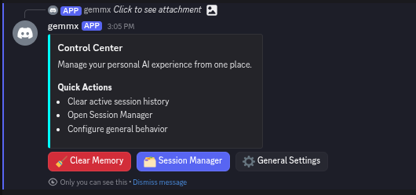
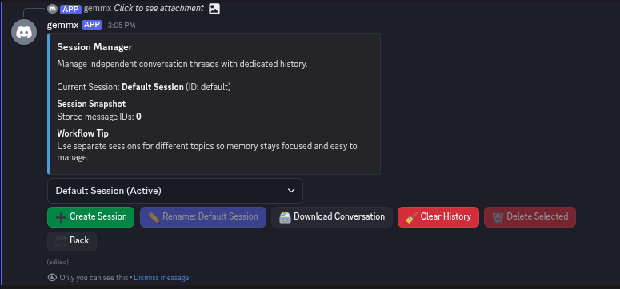
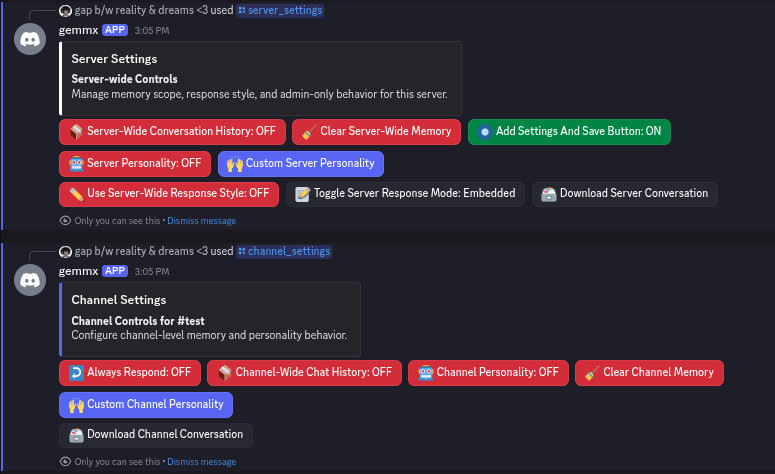
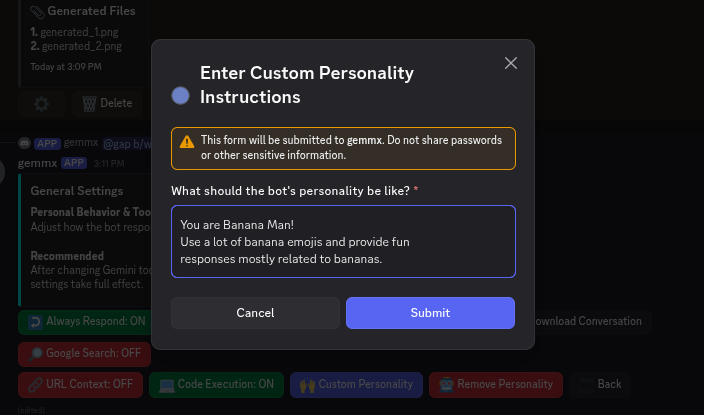

### Chat and Responses

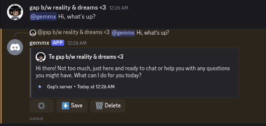
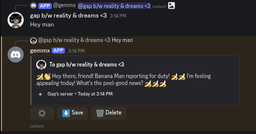

### Tooling and Grounded Responses

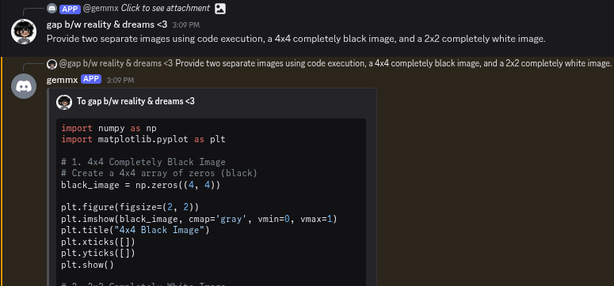
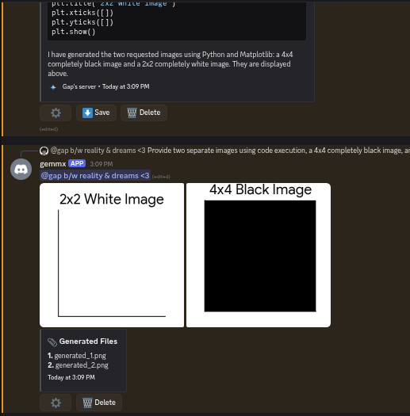
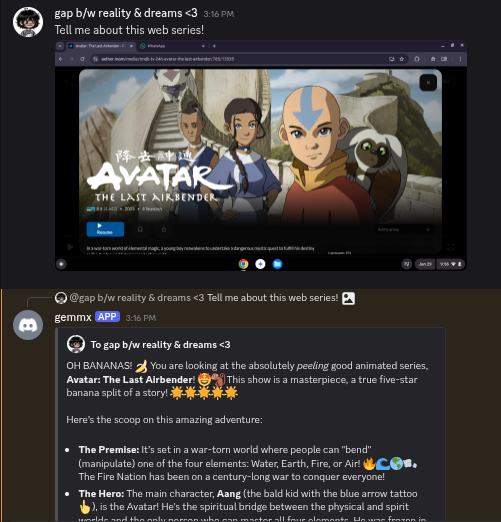
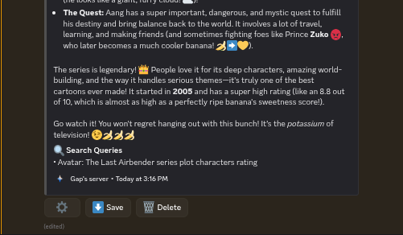

### Downloads and Sharing

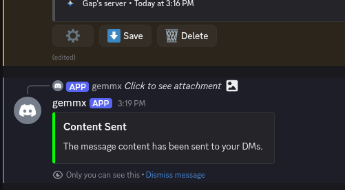
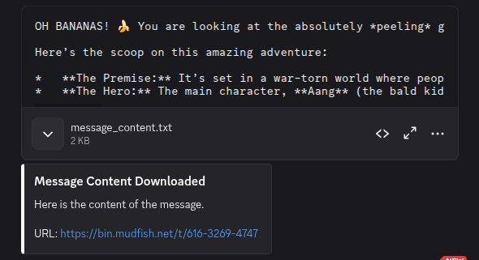
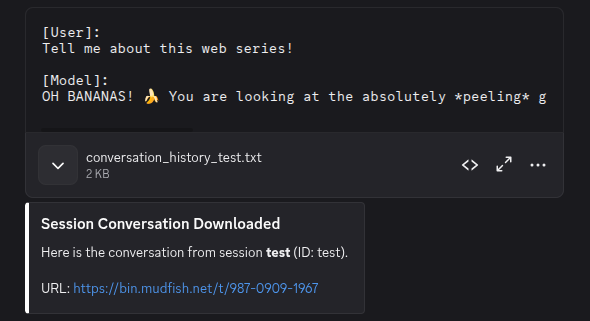

## Configuration

Core defaults live in `config.js`:

- Model: `gemini-flash-lite-latest`
- Max generation attempts: `3`
- Default response mode: `Embedded`
- Tool defaults: Google Search = on, URL Context = on, Code Execution = off

## Project Structure

```text
src/
  core/        runtime setup and shared paths
  handlers/    message and interaction routing
  services/    Gemini orchestration, attachments, streaming, sessions
  state/       JSON persistence, history lifecycle, locking
  ui/          Discord settings views and action buttons
  utils/       Discord and error formatting helpers
```

Runtime data is stored in `config/` and temporary files in `temp/`.

## Notes

- Keep `.env` private and never commit secrets.
- Conversation/state is persisted locally as JSON files.

## License

MIT ([LICENSE.md](LICENSE.md))
